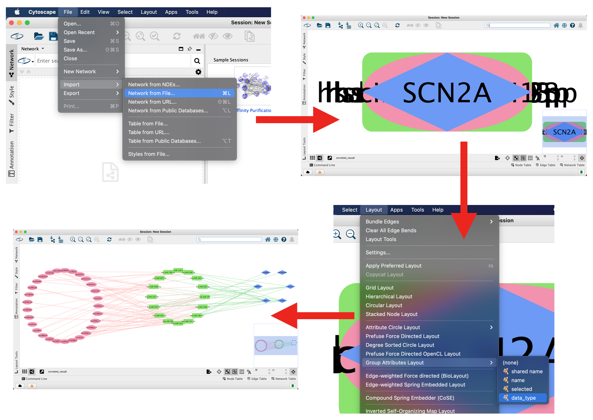

# CircMiMi

A package for constructing CLIP-seq data-supported circRNA-miRNA-mRNA interactions

# Table of Contents
- [Requirements](#requirements)
- [Installation](#installation)
- [Quick Start](#quick-start)
- [Usage](#usage)
  - [Generate the references](#generate-the-references)
    - [Parameters](#parameters)
    - [Available species and sources](#available-species-and-sources)
  - [(Optional) Check the circRNAs](#optional-check-the-circrnas)
    - [Parameters](#parameters-1)
    - [Input file](#input-file)
    - [Output file](#output-file)
      - [checking.results.tsv](#checkingresultstsv)
  - [Predict the interactions between circRNA-miRNA-mRNA](#predict-the-interactions-between-circrna-mirna-mrna)
    - [Parameters](#parameters-2)
    - [Input file](#input-file-1)
    - [Output files](#output-files)
      - [summary_list.tsv](#summary_listtsv)
      - [all_interactions.miRNA.tsv](#all_interactionsmirnatsv)
  - [(Optional) Visualize the interactions](#optional-visualize-the-interactions)
    - [Parameters](#parameters-3)
    - [Import the XGMML file into Cytoscape](#import-the-xgmml-file-into-cytoscape)
- [Example](#example)


# Requirements

- Python (3.6 or above)
- External tools
  - bedtools (2.29.0) (https://github.com/arq5x/bedtools2)
  - miranda (aug2010, 3.3a) (http://www.microrna.org/microrna/getDownloads.do)
  - blat (https://genome.ucsc.edu/FAQ/FAQblat.html)
  - blast (https://blast.ncbi.nlm.nih.gov/Blast.cgi)


# Installation

The recommended way is via `conda`, a package and environment management system. (https://docs.conda.io/en/latest/)


You may install `circmimi` by the following steps:
```bash
$ conda create -n circmimi python=3
$ conda activate circmimi
$ pip install circmimi
```

For the external tools, they can also be installed via `conda` with the `bioconda`(https://bioconda.github.io/) channel:
```bash
$ conda install -c bioconda bedtools=2.29.0 miranda blat blast
```


Now, you can try the following command to test the installation,
```bash
$ circmimi_tools --help
```
it should print out with the help messages.


# Quick Start

1. Generate the references

```bash
$ circmimi_tools genref --species hsa --source ensembl --version 100 refs/
```


2. Check the circRNAs and do some pre-filtering (optional)
```bash
$ circmimi_tools checking -r refs/ -i circRNAs.tsv -o out/ -p 5 --dist 10000
$ cat out/checking.results.tsv | awk -F'\t' '($9==1)&&($12==0)&&($16==1)' | cut -f '-5' > out/circRNAs.filtered.tsv
```


3. Predict the interactions between circRNA-miRNA-mRNA

```bash
$ circmimi_tools interactions -r refs/ -i out/circRNAs.filtered.tsv -o out/ -p 5 --miranda-sc 175
```
Note. Step 2. is optional, you may just input the raw "circRNAs.tsv".


4. Visualize the interactions by creating a Cytoscape-acceptable XGMML file (optional)

```bash
$ circmimi_tools visualize out/all_interactions.miRNA.tsv out/all_interactions.miRNA.xgmml
```


# Usage
## Generate the references

```
circmimi_tools genref --species SPECIES --source SOURCE [--version RELEASE_VER] REF_DIR
```

### Parameters
Parameter             | Description
:-------------------- | :------------------------------
--species SPECIES     | Assign the species for references. Use the species code for SPECIES. ***[required]***
--source SOURCE       | Available values for SOURCE: "ensembl", "ensembl_plants", "ensembl_metazoa", "gencode". ***[required]***
--version RELEASE_VER | The release version of the SOURCE. For examples,  "98" for ("hsa", "ensembl"), "M24" for ("mmu", "gencode"). If the version is not specified, the latest one will be used.
REF_DIR               | The directory for all generated references.


### Available species and sources

Code | Name                    |  E  |  G  |  EP |  EM |  MB | MTB | MDB | ECR |
:--  | :---------------------- | :-: | :-: | :-: | :-: | :-: | :-: | :-: | :-: |
ath  | Arabidopsis thaliana    |     |     |  V  |     |  V  |  V  |     |     |
bmo  | Bombyx mori             |     |     |     |  V  |  V  |  V  |     |     |
bta  | Bos taurus              |  V  |     |     |     |  V  |  V  |     |     |
cel  | Caenorhabditis elegans  |  V  |     |     |  V  |  V  |  V  |     |     |
cfa  | Canis familiaris        |  V  |     |     |     |  V  |  V  |  V  |     |
cgr  | Cricetulus griseus      |  V  |     |     |     |  V  |  V  |     |     |
dre  | Danio rerio             |  V  |     |     |     |  V  |  V  |     |     |
dme  | Drosophila melanogaster |  V  |     |     |     |  V  |  V  |     |     |
gga  | Gallus gallus           |  V  |     |     |     |  V  |  V  |  V  |     |
hsa  | Homo sapiens            |  V  |  V  |     |     |  V  |  V  |  V  |  V  |
mmu  | Mus musculus            |  V  |  V  |     |     |  V  |  V  |  V  |  V  |
osa  | Oryza sativa            |     |     |  V  |     |  V  |  V  |     |     |
ola  | Oryzias latipes         |  V  |     |     |     |  V  |  V  |     |     |
oar  | Ovis aries              |  V  |     |     |     |  V  |  V  |     |     |
rno  | Rattus norvegicus       |  V  |     |     |     |  V  |  V  |  V  |     |
ssc  | Sus scrofa              |  V  |     |     |     |  V  |  V  |     |     |
tgu  | Taeniopygia guttata     |  V  |     |     |     |  V  |  V  |     |     |
xtr  | Xenopus tropicalis      |  V  |     |     |     |  V  |  V  |     |     |

###### Gene annotation
   - **E**: Ensembl (https://www.ensembl.org/index.html)
   - **G**: Gencode (https://www.gencodegenes.org/)
   - **EP**: Ensembl Plants (https://plants.ensembl.org/index.html)
   - **EM**: Ensembl Metazoa (https://metazoa.ensembl.org/index.html)

###### Database for miRNAs
   - **MB**: miRBase (v22) (http://www.mirbase.org/)

###### Databases for miRNA-mRNA interactions
   - **MTB**: miRTarBase (v7.0) ~(http://mirtarbase.mbc.nctu.edu.tw/php/index.php)~ (https://mirtarbase.cuhk.edu.cn/~miRTarBase/miRTarBase_2019/php/index.php)
   - **MDB**: miRDB (v6.0) (http://mirdb.org/)

###### Databases for miRNA-mRNA interactions and RBP-related data
   - **ECR**: ENCORI (http://starbase.sysu.edu.cn/index.php)


## (Optional) Check the circRNAs
```
circmimi_tools checking -r REF_DIR -i CIRC_FILE [-o OUT_PREFIX] [-p NUM_PROC] [--dist INTEGER]
```

### Parameters
Parameter                   | Description
:-------------------------- | :------------------------------
-r, --ref REF_DIR           | The directory of the pre-genereated reference files. ***[required]***
-i, --circ CIRC_FILE        | The file of circRNAs. ***[required]***
-o, --out-prefix OUT_PREFIX | The prefix for the output filenames. (default: "./")
-p, --num_proc NUM_PROC     | The number of processors.
-d, --dist INTEGER          | The distance range for RCS checking. (default: 10000)


### Input file

The input file(CIRC_FILE) is a TAB-separated file with the following columns:

\#   | Column  | Description
:--: | :-----: | :----------
  1  |  chr    | Chromosome name
  2  |  pos1   | One of the positions of the circRNA junction site
  3  |  pos2   | Another position of the circRNA junction site
  4  |  strand | + / -
  5  |  circ_id | (Optional) User-specified name/id of the circRNA

#### Note.
- The chromosome name must be the same as the name in the SOURCE.
  - For example, "1" for "ensembl", and "chr1" for "gencode".


### Output file

#### checking.results.tsv

\#   | Column          | Description
:--: | :-------------- | :----------
  1  |  chr            | Chromosome name
  2  |  pos1           | One of the position of the circRNA junction site
  3  |  pos2           | Another position of the circRNA junction site
  4  |  strand         | + / -
  5  |  circ_id        | The user-specified or auto-generated name/id of the circRNA.
  6  |  host_gene      | The gene symbol of the host gene
  7  |  donor_site_at_the_annotated_boundary | '1' if the donor site of the circRNA is at the annotated exon boundary. Otherwise '0'.
  8  |  acceptor_site_at_the_annotated_boundary | '1' if the acceptor site of the circRNA is at the annotated exon boundary. Otherwise '0'.
  9  |  donor_acceptor_sites_at_the_same_transcript_isoform | '1' if the donor and acceptor are at the same annotated transcript isoform. Otherwise '0'.
 10  |  with an alternative co-linear explanation | '1' if the merged flanking sequence of the circRNA junction sites has an co-linear explanation. Otherwise '0'.
 11  |  with multiple_hits | '1' if the merged flanking sequence of the circRNA junction sites is with multiple hits. Otherwise '0'.
 12  |  alignment ambiguity (with an alternative co-linear explanation or multiple hits) | '1' if the merged flanking sequence of the circRNA junction sites is with an alternative co-linear explanation or with multiple hits. Otherwise '0'.
 13  |  #RCS across flanking sequences | The number of RCS pairs of which across flanking sequences.
 14  |  #RCS within the flanking sequence (the donor side) | The number of RCS pairs of which within the flanking sequences of donor site.
 15  |  #RCS within the flanking sequence (the acceptor side) | The number of RCS pairs of which within the flanking sequences of acceptor site.
 16  |  #RCS_across-#RCS_within>=1 (yes: 1; no: 0) | 


## Predict the interactions between circRNA-miRNA-mRNA

```
circmimi_tools interactions -r REF_DIR -i CIRC_FILE [-o OUT_PREFIX] [-p NUM_PROC] \
[--miranda-sc SCORE] [--miranda-en ENERGY] [--miranda-scale SCALE] [--miranda-strict] [--miranda-go X] [--miranda-ge Y]
```

### Parameters
Parameter                   | Description
:-------------------------- | :------------------------------
-r, --ref REF_DIR           | The directory of the pre-genereated reference files. ***[required]***
-i, --circ CIRC_FILE        | The file of circRNAs. ***[required]***
-o, --out-prefix OUT_PREFIX | The prefix for the output filenames. (default: "./")
-p, --num_proc NUM_PROC     | The number of processors.

The miRanda parameters are also available (see [the manual of miRanda](http://cbio.mskcc.org/microrna_data/manual.html)).

Parameters | Description
:-------------------------- | :------------------------------
--miranda-sc SCORE | Set the alignment score threshold to SCORE. Only alignments with scores >= SCORE will be used for further analysis. (default: 155)
--miranda-en ENERGY | Set the energy threshold to ENERGY. Only alignments with energies <= ENERGY will be used for further analysis. A negative value is required for filtering to occur. (default: -20)
--miranda-scale SCALE | Set the scaling parameter to SCALE. This scaling is applied to match / mismatch scores in the critical 7bp region near the 5' end of the microRNA. Many known examples of miRNA:Target duplexes are highly complementary in this region. This parameter can be thought of as a contrast function to more effectively detect alignments of this type. (default: 4.0)
--miranda-strict | Require strict alignment in the seed region (offset positions 2-8). This option prevents the detection of target sites which contain gaps or non-cannonical base pairing in this region.
--miranda-go X | Set the gap-opening penalty to X for alignments. This value must be negative. (default: -4.0)
--miranda-ge Y | Set the gap-extend penalty to Y for alignments. This value must be negative. (default: -9.0)


### Input file

The input file(CIRC_FILE) is a TAB-separated file with the following columns:

\#   | Column  | Description
:--: | :-----: | :----------
  1  |  chr    | Chromosome name
  2  |  pos1   | One of the position of the circRNA junction site
  3  |  pos2   | Another position of the circRNA junction site
  4  |  strand | + / -
  5  |  circ_id | (Optional) User-specified name/id of the circRNA

#### Note.
- The chromosome name must be the same as the name in the SOURCE.
  - For example, "1" for "ensembl", and "chr1" for "gencode".


### Output files
There would output two main files:
 - "summary_list.tsv"
 - "all_interactions.miRNA.tsv"


#### summary_list.tsv
The summary list contains the counts of interactions and some checking results of the circRNAs.

\#   | Column          | Description
:--: | :-------------- | :----------
  1  |  chr            | Chromosome name
  2  |  pos1           | One of the position of the circRNA junction site
  3  |  pos2           | Another position of the circRNA junction site
  4  |  strand         | + / -
  5  |  circ_id        | The user-specified or auto-generated name/id of the circRNA.
  6  |  host_gene      | The gene symbol of the host gene
  7  |  #circRNA_miRNA | Count for the circRNA-miRNA interactions.
  8  |  #circRNA_mRNA  | Count for the miRNAs-mediated circRNA-mRNA interactions.
  9  |  #circRNA_miRNA_mRNA | Count for the circRNA-miRNA-mRNA interactions.
 10  |  pass           | 'yes' if the circRNA passing all of the checking items (column 11 to 15). Otherwise 'no'.
 11  |  donor site not at the annotated boundary | '1' if the donor site of the circRNA is NOT at the annotated exon boundary. Otherwise '0'.
 12  |  acceptor site not at the annotated boundary | '1' if the acceptor site of the circRNA is NOT at the annotated exon boundary. Otherwise '0'.
 13  |  donor/acceptor sites not at the same transcript isoform | '1' if the donor and acceptor are not at the same annotated transcript isoform. Otherwise '0'.


#### all_interactions.miRNA.tsv

\#   | Column          | Description
:--: | :-------------- | :----------
  1  |  chr            | Chromosome name
  2  |  pos1           | One of the position of the circRNA junction site
  3  |  pos2           | Another position of the circRNA junction site
  4  |  strand         | + / -
  5  |  circ_id        | The user-specified or auto-generated name/id of the circRNA.
  6  |  host_gene      | Host gene of the circRNA
  7  |  mirna          | The miRNA which may bind on the circRNA
  8  |  max_score      | The maximum binding score reported by miRanda
  9  |  num_binding_sites | The number of binding sites of the miRNA on the circRNA
 10  |  cross_boundary | Whether if there are binding sites across the junction of the circRNA.
 11  |  MaxAgoExpNum   | The maximum number of supporting CLIP-seq experiments
 12  |  num_AGO_supported_binding_sites | The number of AGO-supported miRNA-binding sites
 13  |  target_gene    | The miRNA-targeted gene
 14  |  miRTarBase     | Whether if the miRNA-mRNA interaction is reported from miRTarBase.
 15  |  miRDB          | Whether if the miRNA-mRNA interaction is reported from miRDB.
 16  |  ENCORI         | Whether if the miRNA-mRNA interaction is reported from ENCORI.
 17  |  category_1     | Whether if the circRNA-miRNA-mRNA interaction is of category 1.
 18  |  category_2     | Whether if the circRNA-miRNA-mRNA interaction is of category 2.
 19  |  category_3     | Whether if the circRNA-miRNA-mRNA interaction is of category 3.
 20  |  p_value        | P-value from the hypergeometric test for the circRNA-mRNA interaction.
 21  |  bh_corrected_p_value | P-value corrected by the "Benjamini-Hochberg" method.
 22  |  bonferroni_corrected_p_value | P-value corrected by the "Bonferroni" method.


#### Note.
For now, the ENCORI data are only provided for 'human' and 'mouse'.


## (Optional) Visualize the interactions

```
circmimi_tools visualize [options] IN_FILE OUT_FILE
```

### Parameters
Parameter     | Description
:------------ | :------------------------------
IN_FILE       | Input the file "all_interactions.miRNA.tsv", which is the output file from 'interactions'.
OUT_FILE      | The output filename. The file extension should be ".xgmml" or ".xml", so that the Cytoscape could recognize this file as an XGMML network file.
-1 INT        | column key for circRNAs.
-2 INT        | column key for mediators.
-3 INT        | column key for mRNAs.
--no-header   | This flag option should be speciefied if there are no headers in the IN_FILE.


This command can generate a Cytoscape-executable file (.xgmml) for visualization of the input circRNA-miRNA-mRNA regulatory axes in Cytoscape.

### Import the XGMML file into Cytoscape

To do the visualization with Cytoscape(https://cytoscape.org/index.html), please refer to the followings:

1. Open the Cytoscape.
2. Import the XGMML file from [File] -> [Import] -> [Network from File...], and then choose the ".xgmml" file.

By default, CircMiMi did not embed any layout in the XGMML file, but only nodes and edges which are all at the origin,
 so that you may create your own layout by interest.

Here, for example, we apply the built-in "Group Attributes Layout" with the column "data_type"(which equals to 'circRNA', 'mediator', or 'target_gene'). As you can see, the nodes are now separated and grouped by their "data_type".





# Example

Please see the "[examples](examples)" directory.